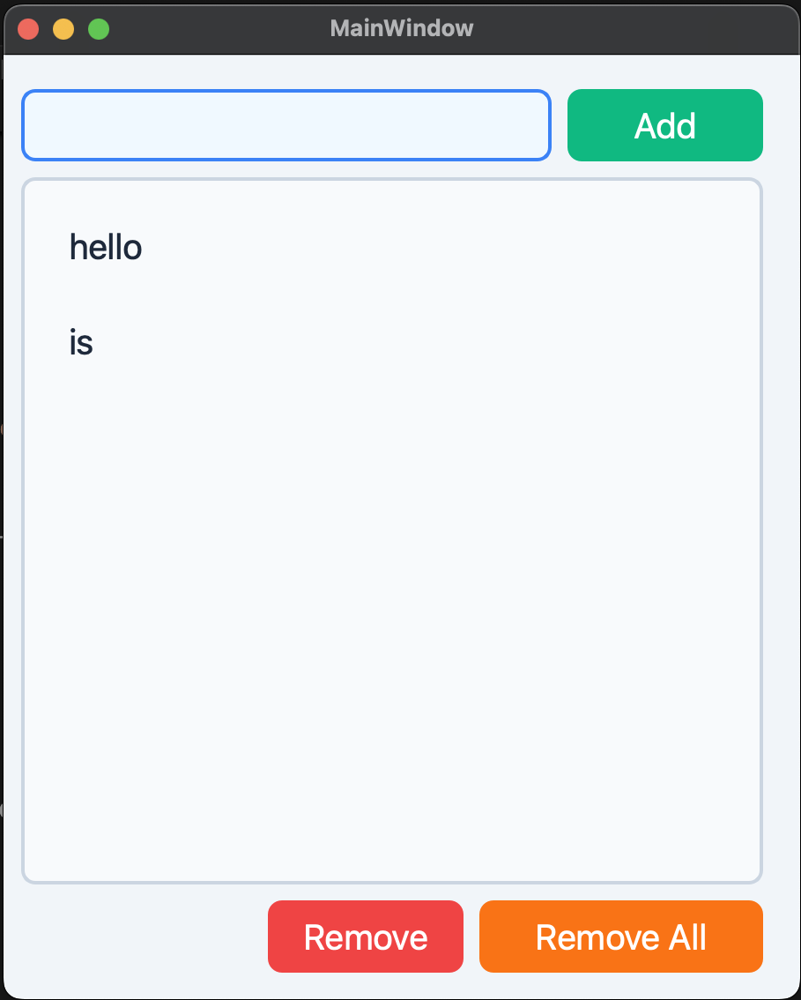

# 📝 Qt6 To-Do App

A simple and modern To-Do desktop application built using **Qt6 and C++**. This app allows you to add, edit, remove, and save tasks to a file on your system.

## 🚀 Features

- ✅ Add new tasks  
- 🗑️ Remove selected task  
- 🔄 Remove all tasks  
- ✏️ Edit tasks directly in the list  
- 💾 Automatically saves tasks to a local file  
- 📂 Loads tasks on app start from your Documents folder  

## 📂 File Storage

Tasks are saved to:

```
~/Documents/toDoFile.txt
```

This file is created automatically and updated every time the app closes.

---

## 🛠️ Technologies Used

- Qt 6  
- C++  
- Qt Widgets  
- Qt Designer (for GUI)  

---

## 📦 How to Run

### 1. Clone the repository

```bash
git clone https://github.com/your-username/qt6-todo-app.git
cd qt6-todo-app
```

### 2. Open in Qt Creator

- Open the `.pro` file in **Qt Creator**  
- Select the appropriate Qt 6.x Desktop Kit  
- Click the **Run** button  

### 3. Or build manually using CMake

```bash
mkdir build
cd build
cmake ..
make
./qt6-todo-app
```

---

## 📁 Project Structure

```
qt6-todo-app/
├── main.cpp              # Application entry point
├── mainwindow.h          # MainWindow header
├── mainwindow.cpp        # MainWindow implementation
├── mainwindow.ui         # UI layout (Qt Designer)
├── toDoFile.txt          # Auto-created task storage file (in Documents folder)
└── README.md             # This file
```

---

## 🖼️ UI Preview

> Add a screenshot named `screenshot.png` to display your app preview below:



---

## 📃 License

This project is licensed under the [MIT License](LICENSE).

---

## 🙌 Author

Made with 💻 using Qt6 by **[Your Name](https://github.com/your-username)**
